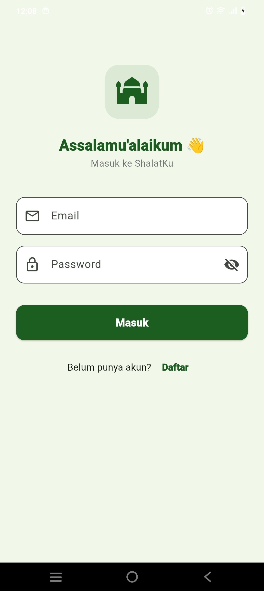
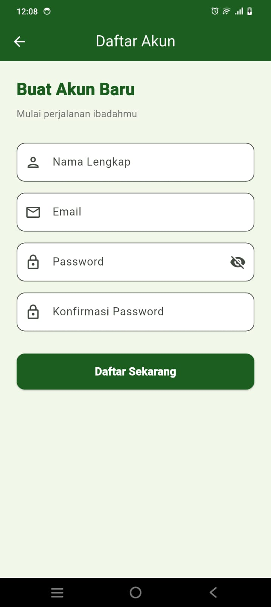
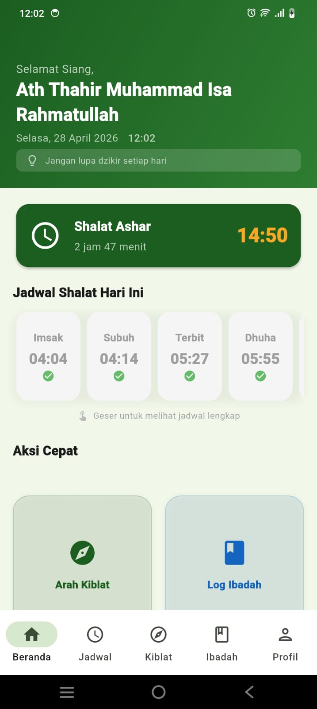
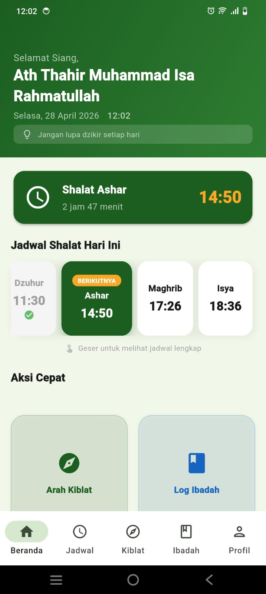
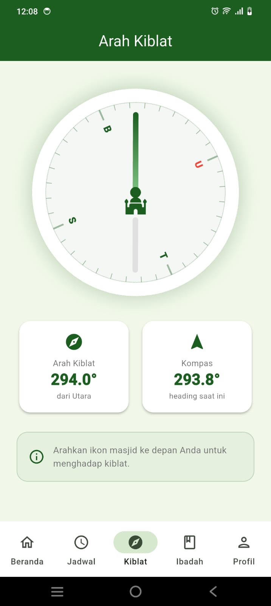
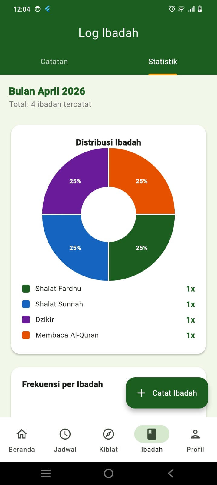
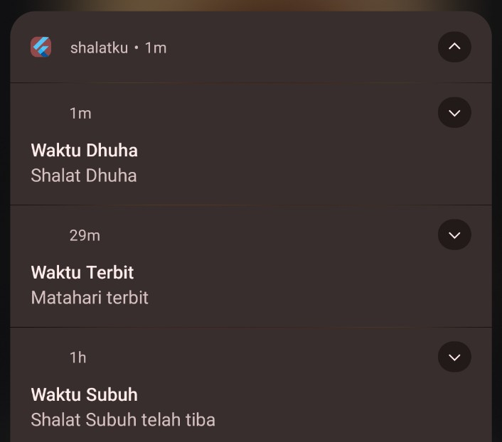
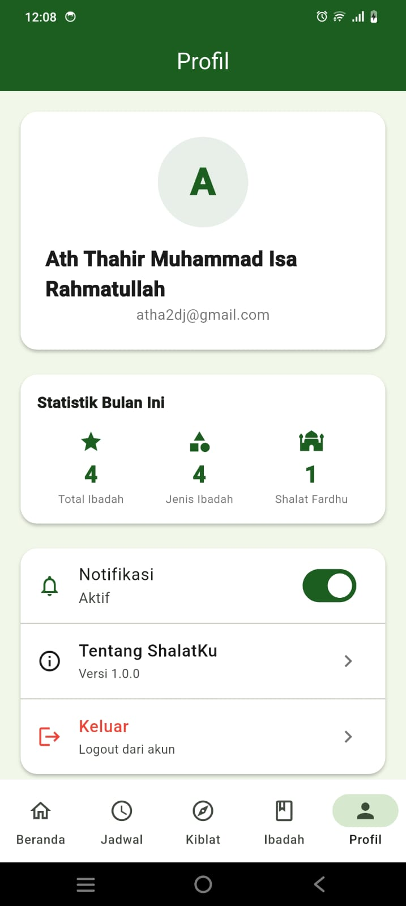

# 🕌 ShalatKu

Aplikasi Flutter untuk jadwal shalat, arah kiblat, dan tracker ibadah harian.

**Dibuat oleh:** Ath Thahir Muhammad Isa Rahmatullah — NRP 5025231181  
**Kontak:** wa.me/+6285331238980

---

## 🎬 Demo Video

Tonton demo presentasi aplikasi di sini:

[](https://youtu.be/cBjhd9NWtc8 "ShalatKu - Prayer Times & Worship Tracker App")

**Link:** https://youtu.be/cBjhd9NWtc8

---

## 📸 Screenshots

### 🔐 Autentikasi
| Login | Register |
|-------|----------|
|  |  |

### 🏠 Beranda
| Home - View 1 | Home - View 2 |
|---------------|--------------|
|  |  |

### ⚡ Akses Cepat
| Quick Access |
|--------------|
|  |

### 🕌 Jadwal Shalat
| Jadwal Shalat - View 1 | Jadwal Shalat - View 2 |
|------------------------|------------------------|
|  |  |

### 🧭 Arah Kiblat
| Arah Kiblat |
|------------|
|  |

### 📿 Log Ibadah
| Tambah Ibadah | Log Ibadah |
|---------------|-----------|
|  |  |

### 📊 Statistik & Laporan
| Statistik |
|-----------|
|  |

### 🔔 Notifikasi
| Notifikasi |
|-----------|
|  |

### 👤 Profil & Pengaturan
| Profil |
|--------|
|  |

---

## ✨ Fitur

| Fitur | Deskripsi |
|-------|-----------|
| 🔐 **Auth** | Login & Register via Firebase Auth |
| 🕌 **Jadwal Shalat 8x** | Imsak, Subuh, Terbit, Dhuha, Dzuhur, Ashar, Maghrib, Isya (real-time update) |
| 🧭 **Arah Kiblat** | Kompas realtime menggunakan sensor + perhitungan GPS |
| 📿 **Log Ibadah** | CRUD catatan ibadah dengan 6 tipe preset + custom type |
| 📝 **Catatan Lengkap** | Field catatan mendalam (lokasi, kondisi, doa, peserta) |
| 🚫 **Duplicate Check** | Deteksi & warning jika sama type ibadah di hari yang sama |
| 📊 **Statistik** | Pie chart & bar chart ibadah bulanan |
| 🔔 **Notifikasi** | Notifikasi adzan otomatis (8 waktu shalat) + pengingat ibadah |
| ⚙️ **Toggle Notifikasi** | Aktif/nonaktif notifikasi di Profil (persisten) |
| 🌍 **Auto Reload** | Otomatis reload jadwal shalat saat masuk hari baru |
| 👤 **Profil** | Ringkasan statistik & pengaturan notifikasi |

---

## ✅ Mini Project Requirements (40%)

Semua requirement sudah terpenuhi:

| Requirement | Status | Detail |
|------------|--------|--------|
| **CRUD dengan Relational Database** ✓ | 10% | CRUD ibadah log di Firestore + relasi dengan user auth |
| **Firebase Authentication** ✓ | 5% | Login, Register, Logout dengan Firebase Auth |
| **Menyimpan Data ke Firebase** ✓ | 5% | Cloud Firestore untuk ibadah logs & user preferences |
| **Notifikasi** ✓ | 5% | Notifikasi adzan otomatis + pengingat ibadah custom |
| **Smartphone Resources** ✓ | 5% | GPS (jadwal shalat) + Sensor Kompas (arah kiblat) |
| **Demo Video & GitHub** ✓ | 10% | Video demo: https://youtu.be/cBjhd9NWtc8 + GitHub repository |

---

## 🚀 Setup

### 1. Prasyarat
- Flutter SDK ≥ 3.0
- Firebase project (buat di https://console.firebase.google.com)
- FlutterFire CLI

### 2. Clone & install
```bash
flutter pub get
```

### 3. Setup Firebase
```bash
# Install FlutterFire CLI (sekali saja)
dart pub global activate flutterfire_cli

# Hubungkan ke Firebase project kamu
flutterfire configure
```
> Ini akan otomatis generate `lib/firebase_options.dart` yang benar.  
> **Jangan lupa aktifkan:** Authentication (Email/Password) & Firestore di Firebase Console.

### 4. Tambahkan ke AndroidManifest.xml
```xml
<!-- android/app/src/main/AndroidManifest.xml -->
<uses-permission android:name="android.permission.ACCESS_FINE_LOCATION"/>
<uses-permission android:name="android.permission.ACCESS_COARSE_LOCATION"/>
<uses-permission android:name="android.permission.RECEIVE_BOOT_COMPLETED"/>
<uses-permission android:name="android.permission.VIBRATE"/>
<uses-permission android:name="android.permission.SCHEDULE_EXACT_ALARM"/>
```

### 5. Tambahkan ke Info.plist (iOS)
```xml
<key>NSLocationWhenInUseUsageDescription</key>
<string>Digunakan untuk jadwal shalat dan arah kiblat</string>
<key>NSLocationAlwaysUsageDescription</key>
<string>Digunakan untuk notifikasi adzan</string>
```

### 6. Setup Firestore Rules
```
rules_version = '2';
service cloud.firestore {
  match /databases/{database}/documents {
    match /{document=**} {
      allow read, write: if request.auth != null;
    }
  }
}
```
> **Catatan:** Rules ini permissive untuk development. Untuk production, gunakan rules yang lebih restrictive:
> ```
> match /ibadah_logs/{logId} {
>   allow read, write: if request.auth.uid == resource.data.userId;
> }
> ```

### 7. Jalankan
```bash
flutter run
```

---

## 🗂️ Struktur Project

```
lib/
├── main.dart                    # Entry point
├── firebase_options.dart        # Firebase config (generate via flutterfire)
├── models/
│   ├── ibadah_log.dart          # Model data log ibadah
│   └── prayer_time_model.dart   # Model waktu shalat
├── services/
│   ├── auth_service.dart        # Firebase Auth logic
│   ├── firestore_service.dart   # CRUD Firestore
│   ├── location_service.dart    # GPS + kalkulasi kiblat
│   ├── prayer_time_service.dart # Kalkulasi waktu shalat (adhan)
│   └── notification_service.dart# Local notifications
├── providers/
│   ├── auth_provider.dart       # State manajemen auth
│   ├── ibadah_provider.dart     # State manajemen ibadah
│   └── prayer_provider.dart     # State manajemen shalat & kiblat
├── screens/
│   ├── splash_screen.dart
│   ├── auth/login_screen.dart
│   ├── auth/register_screen.dart
│   ├── home/home_screen.dart
│   ├── prayer_times/prayer_times_screen.dart
│   ├── qibla/qibla_screen.dart
│   ├── ibadah/ibadah_log_screen.dart
│   ├── ibadah/add_ibadah_screen.dart
│   └── profile/profile_screen.dart
├── widgets/
│   ├── prayer_card.dart
│   └── ibadah_tile.dart
└── utils/
    ├── theme.dart
    └── constants.dart
```

---

## 📦 Dependencies

| Package | Kegunaan |
|---------|----------|
| `firebase_auth` | Autentikasi user |
| `cloud_firestore` | Database cloud (query optimized) |
| `geolocator` | Akses GPS |
| `flutter_compass` | Sensor kompas |
| `adhan` | Kalkulasi waktu shalat |
| `flutter_local_notifications` | Notifikasi adzan & pengingat |
| `timezone` | Time zone handling (Asia/Jakarta) |
| `shared_preferences` | Menyimpan pengaturan notifikasi |
| `provider` | State management |
| `fl_chart` | Chart statistik (pie & bar) |
| `intl` | Format tanggal (Bahasa Indonesia) |
| `http` | HTTP request untuk API shalat |

---

## 🏗️ Arsitektur & Optimasi

### Firestore Query Optimization
- [✓] Menghindari composite index yang kompleks
- [✓] Menggunakan simple single-WHERE queries
- [✓] Client-side filtering untuk date range & sorting
- **Result:** Faster queries tanpa index creation delay

### State Management
- Provider pattern untuk Auth, Prayer, Ibadah
- Real-time listeners untuk data changes
- Efficient rebuilds hanya ketika data berubah

### Notifikasi
- Scheduled notifications untuk 8 waktu shalat
- Local notifications dengan custom messages
- Toggle-aware: respek user preferences
- Error handling & graceful fallbacks

### UI/UX Enhancements
- Real-time time update (setiap detik)
- Auto reload jadwal shalat saat hari berganti
- Duplicate warning dialog untuk same-day ibadah
- Responsive grid layout (2 columns untuk quick actions)

---

## � Sistem Notifikasi

### Cara Kerja

#### 1. **Notifikasi Adzan (8 Waktu Shalat)**
- **Otomatis dijadwalkan** saat app dimulai untuk 8 waktu shalat: Imsak, Subuh, Terbit, Dhuha, Dzuhur, Ashar, Maghrib, Isya
- **Jadwal realtime:** Notifikasi disesuaikan dengan lokasi dan zona waktu pengguna (auto-detect Asia/Jakarta)
- **Smart scheduling:** Jika app berjalan saat/dekat waktu shalat, notifikasi tetap dijadwalkan dengan buffer 10 detik ke depan
- **Notifikasi berulang:** Hanya muncul sekali per waktu shalat, tapi di-reschedule setiap hari baru

#### 2. **Notifikasi Pengingat Ibadah**
- Notifikasi custom ketika pengguna menambah reminder ibadah
- Dapat dikustomisasi dengan pesan personal
- Terintegrasi dengan Log Ibadah

### Fitur Notifikasi

| Fitur | Deskripsi |
|-------|-----------|
| **Aktif/Nonaktif** | Toggle notifikasi di halaman Profil (setting tersimpan via SharedPreferences) |
| **8 Waktu Shalat** | Subuh, Terbit, Dhuha, Dzuhur, Ashar, Maghrib, Isya + Imsak |
| **Sound & Vibration** | Notifikasi dengan suara dan getar (customizable di system settings) |
| **Auto-reschedule** | Otomatis reschedule setiap hari jam 00:00 |
| **Error Handling** | Fallback jika jadwal tidak bisa dijadwalkan (scheduled time sudah berlalu) |
| **Timezone Support** | Menggunakan timezone lokal device (Asia/Jakarta by default) |

### Troubleshooting Notifikasi

**Notifikasi tidak muncul?**
1. Cek setting notifikasi di halaman Profil (pastikan toggle ON)
2. Cek permission di System Settings > Notifications (izinkan "ShalatKu")
3. Pastikan waktu device akurat
4. Restart app atau tunggu notifikasi re-schedule di tengah malam

**Notifikasi muncul terlambat?**
- Ini normal jika device dalam deep sleep. Android akan deliver notifikasi saat device bangun.
- Jika penting, gunakan scheduled notifications dengan mode exact alarm (requires SCHEDULE_EXACT_ALARM permission).

**Setting notifikasi tidak tersimpan?**
- Pastikan app punya permission untuk akses SharedPreferences
- Coba clear app cache: Settings > Apps > ShalatKu > Storage > Clear Cache

---

## �🔐 Keamanan

- **Firebase Rules:** User hanya bisa akses data milik mereka
- **Auth:** Email/Password dengan Firebase Authentication
- **Permissions:** GPS, location, notifications diizinkan runtime
- **Data:** Tersimpan encrypted di Firestore

---

## 📚 Credits & Acknowledgments

- **Al-Quran API:** [Equran.id](https://equran.id/apidev) - API data Al-Quran gratis & open source

---
